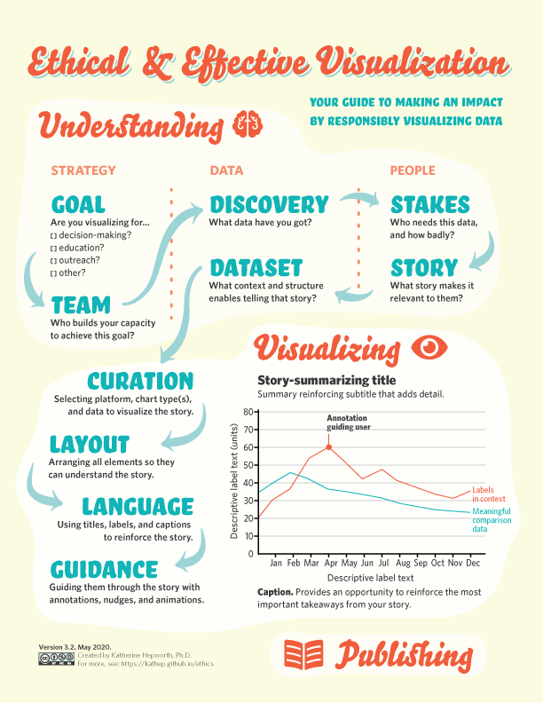

## Poster

Download a printable pdf [here](pdfs/ethical_visualization_poster_3_2.pdf).

&nbsp;

------------------------------

## The steps

### 1. UNDERSTANDING

#### 1A. STRATEGY
> What is your motivation to visualize?

- **Formulate goal**  
  Are you visualizing for...
  - education?
  - outreach?
  - dissemination?
  - other?

- **Assemble a team**  
  Who will help you meet that goal?

  Ethically visualizing data is a team effort, requiring multiple roles that have traditionally been associated with vastly different disciplinary traditions and siloes of knowledge. Four recommended roles outlined below. Some of these skill areas may be found in more than one person. One or more people may fill each role. The more recipients are involved in the process, the better.

  - **Audience**  
    A person or people who from, or are as close as possible to, the intended audience(s). Co-creation is key to impact.  
    *Includes:* readers, participants, users and/or viewers
  - **Data wrangler**  
    A person with skill at cleaning, processing, and structuring data for visual display.  
    *Includes:* computer scientist, data analyst, digital humanist, and/or statistician  
  - **Subject expert**  
    A person with in-depth subject expertise.  
    *Includes:* academic, community organizer, public official and/or scientist
  - **Visual storyteller**  
    A person with skill at ethically simplifying information and communicating it using visual means.  
    *Includes:* communication designer, game designer, graphic recorder, illustrator, and/or journalist

#### 1B. DISCOVERY
> What data have you got?

- **Investigate through analysis**  
    *What can you find in the data using reason-led investigation?*

- **Explore through play**  
    *What can you find in the data using intuition-led exploration?*

#### 1C. STAKES
> Who needs it and how badly?

- **Assess stakes**  
    *What is at stake in this visualization effort?*

- **Establish purpose**  
    *What is your motivation for sharing what you discovered in this data?*

- **Identify intended and unintended audiences**  
    *Who do you want your visualization to reach the most?*

- **Determine impact type**  
    *Which impact type will be most effective for your audiences?*

#### 1D. STORY
> What story makes it relevant to them?

- **Empathize with audiences**  
    *What are your audiences’ greatest needs?*

- **Refine goal**  
    *What is the audience-oriented goal for the visualization?*

- **Create story**  
    *What kind of story best achieves this goal?*

- **Review narrative/framing literature**  
    *What does the literature say about this story?*

#### 1E. DATASET
> How will you process and contextualize the data to tell that story?

- **Combine sources**  
    *What sources will you draw from?*

- **Improve veracity**  
    *Will the data hold up under scrutiny?*

- **Structure data**  
    *Is the dataset intelligible and navigable?*

- **Refine frame**  
    *How does the frame need to be adjusted?*

### 2. VISUALIZING
> What visual data curation best conveys your story?

#### 2A. CURATION
> What platform, chart type(s) and data will visualize your story?

- **Determine media context**  
    *What is the most appropriate media context for your story to reach your audience?*

- **Chooose chart type(s)**  
    *Which chart types tell your story effectively?*

#### 2B. LAYOUT
> How can you arrange all elements so they can understand the story?

- **Design visualization**  
    *What design decisions will visualize the story effectively?*

- **Ensure legibility**

- **Adhere to design principles**

- **Enforce visual consistency**

#### 2C. LANGUAGE
> How can you use titles, labels, and captions to reinforce the story?

- **Ensure readability**

- **Test story**  
    *Does your visualization communicate the story to your audience?*

#### 2D. GUIDANCE
> How can you guide them through the story with annotations, nudges, and animations.

- **Review visualization ethics literature**  
    *What are the latest ethical recommendations?*

- **Re-test story**  
    *Does your visualization communicate the story to your audience better?*

### 3. PUBLISHING
> Why should they trust you?

- **Release visualization**  
    *Will publishing base data do harm to any intended or unintended audience?*

- **Show process & affiliations**  
    *How can your ethical process be best demonstrated?*

- **Measure impact**  
    *What is the felt impact of your published visualization?*

- **Feedback results**  
    *How do the visualization’s intended impact and felt impact compare?*

&nbsp;

-----------------------------

## Participate

### Follow
You can follow development of this work by subscribing to Dr Katherine Hepworth's newsletter at https://broaderimpacts.substack.com.

### Contribute
If you'd like to contribute to the development of this work, please reach out at khepworth at unr dot edu. Referrals to other projects, literature, and methods that may be relevant are welcome, as well as suggestions for improvement or other modes of implmentation.

### Project help
Have a high-stakes visualization you need to make an impact? There are a limited number of spots available for client work under the auspices of the Mick Hitchcock Ph.D. Project for Visualizing Science. To express your interest, reach out at khepworth at unr dot edu.

&nbsp;

-----------------------------

## Credits

### Citation
Hepworth, K. (2020). *Ethical & Effective Visualization.*  (https://DOI.10.5281/zenodo.3773299])[https://zenodo.org/badge/latestdoi/232150677]

From Hepworth, K. 2020. (forthcoming) "Make Me Care: Ethical Visualization for Impact in the Sciences and Data Sciences", *HCII Conference 2020 Proceedings*.

### Funding
The following institutions have supported development of this method.
- Nevada NASA (National Aeronautics and Space Administration) Space Grant Consortium, Award No. NNX15AI02H
- National Endowment of the Humanities Office of Digital Humanities, Award No. [HAA-266490-19](https://securegrants.neh.gov/publicquery/main.aspx?f=1&gn=HAA-266490-19)
- University of Nevada, Reno, various internal grants
- Mick Hitchcock Ph.D. Project for Visualizing Science

### Acknowledgements
Acknowledgement of previous versions can be found in the documentation for each one, listed below. In addition to previous contributions, I am grateful for the discussion and exchanges with the following people, who have informed this version: Jason Forrest of McKinsey, Georgie Rogers, Amanda Makulec, Bridget Cogley, Josh Smith, and Neil Richards of Groupon.

#### test acknowledgement


{{ person.people | where: "version", "3.2" }}



&nbsp;

-----------------------------

## Development

### Updates

This method is regularly updated. It is a key activity of Katherine Hepworth's interdisciplinary research.

### Versions

|Version    |Date   |Title   |
|:---|:---|:---|
| Version 3.2 | May 2020  | Ethical & Effective Visualization  |
| [Version 3.1](ethical_visualization_3_1.md) | April 2020  | Ethical Visualization for Impact  |
| [Version 3.0](ethical_visualization_3_0.md) | March 2020  | Ethical Visualization for Impact  |
| [Version 2.1](ethical_visualization_2_1.md) | October 2019  | Ethical Visualization  |
| [Version 2.0](ethical_visualization_2_0.md)   | October 2019  | Ethical Visualization  |
| [Version 1.1](ethical_visualization_1_1.md)   | May 2019  | Ethical Visualization  |
| [Version 1](ethical_visualization_1_0.md)   | December 2018  | Ethical Visualization Workflow  |

&nbsp;
-----------------------------
[Back to top](#the-steps)
